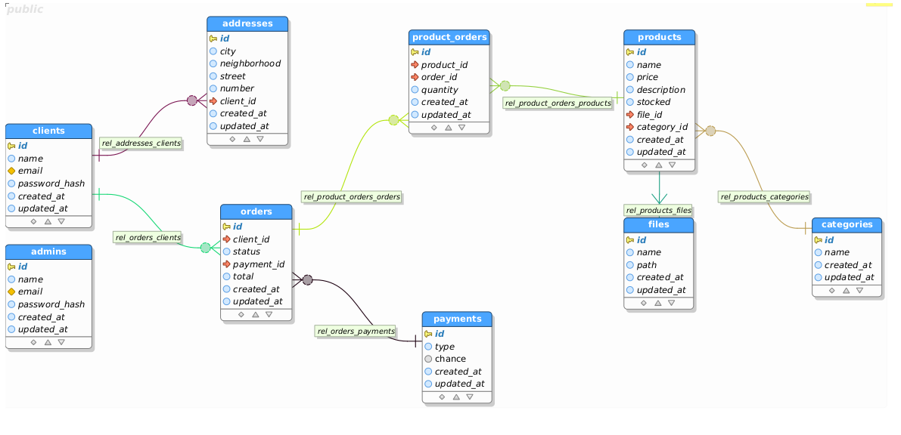

<div align="center">
  <h1> :pizza: Delivery | BackEnd</h1>
</div>

#### Complementary part of the project:
- [FrontEnd](https://github.com/luisgbyte/delivery-frontend)
- [Mobile](https://github.com/luisgbyte/delivery-mobile)

## :memo: Database MER(Relationship Entity Model)


## :hammer_and_wrench: Technologies
- [Javascript ES6+](https://developer.mozilla.org/pt-BR/docs/Web/JavaScript)
- [NodeJs](https://nodejs.org/en/)
- [PostgresSQL](https://www.postgresql.org/)
- [Sequelize](https://sequelize.org/)
- [Express](https://expressjs.com/pt-br/)

## :game_die: How to run the project?
```
# Clone this repository
$ git clone https://github.com/luisgbyte/delivery-web.git

# Access the repository on your terminal
$ cd delivery-backend

# Install dependencies
$ yarn

# Run the project
$ yarn start

# The app will be running on http://localhost:3000
```
<br/>
<p align="center">Made with :orange_heart: by Luis Gustavo | Find me on <a href="https://www.linkedin.com/in/luis-gustavo-soares/">LinkedIn</a></p>
